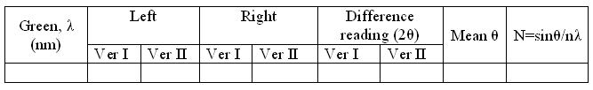
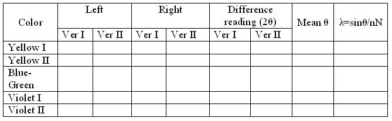

## Procedure

### Apparatus
 

Spectrometer, diffraction grating element and mercury vapor lamp.

### Procedure for real lab
 

The preliminary adjustments of the spectrometer are made. The grating is set for normal incidence. The slit is illuminated by mercury vapour vamp. The telescope is brought in a line with the collimator and the direct image of the slit is made to coincide with the vertical cross wire. The readings of one vernier are noted. The vernier table is firmly clamped. Now, the telescope is rotated exactly through 90° and is fixed in this position. The grating is mounted vertically on the prism table with its ruled surface facing the collimator. The vernier table is released and is slowly rotated till the reflected image coincides with the vertical cross wire. The leveling screws are adjusted so that the image is at the centre of the field of view of the telescope. The prism table is fixed and after making fine adjustments with the tangential screw, the readings of the vernier are noted. Now, the angle of incidence is 45°. The vernier table is then released and rotated exactly through 45° in the proper direction so that the surface of the grating becomes normal to the incident light. The vernier table is firmly clamped in this position.

The telescope is then released and is brought to observe the direct image. On the either side of the direct image, the diffraction spectra are seen.The telescope is turned slowly towards the left so that the vertical cross wire coincides with the violet lines of the first order. The readings of the vernier are taken. The vertical cross wire is then made to coincide with the other lines on the left and the vernier readings are taken in each case. The telescope is then moved to the right and the reading of different lines is similarly taken. The difference between the readings on the left and right on the same vernier is determined for each line. The mean value of this difference gives $2\theta$ -twice the angle of diffraction. Thus the angle of diffraction $\theta$¸ for each spectral line is determined. The wavelength of the green line is $546.1 x10^{-9}$ m. The number of lines per meter (N) of the grating is calculated. Using this value of N, the wavelengths of the other prominent lines in this spectrum are calculated.

### Procedure for simulator:
 

The simulation virtualizes the Mercury spectrum experiment. The user can use a grating spectrometer to measure the wavelengths of Yellow, Green, Violet and Red lines in the visible spectrum of Mercury.

 #### Variable Region:

 - **Telescope Calibrate Slider** : This slider helps the user to change the focus of telescope.
 - **Start Button** : Helps the user to start the experiment after setting the focus of telescope. The Start Button can be activated only if the focus of the telescope is proper.
 - **Light Toggle Button** : Helps the user to switch the lamp ON or OFF.
 - **Grating Toggle Button** : Helps the user to place or remove the grating.
 - **Telescope Angle Slider** : This slider helps the user to change the angle of telescope.
 - **Vernier Angle Slider** : This slider helps the user to change the angle of the Vernier.
 - **Telescope Angle Slider** : Helps make minute changes of the telescope angle.
 - **Calibrating Telescope Button** : Helps the user to calibrate the telescope after starting the experiment, if needed.

 
### Procedure for simulation
 
#### To standardise the grating:
- Turn the telescope to obtain the image of the slit.
- Turn the telescope to both sides to obtain green lines.Note the reading of both the verniers.
- Calculate the difference in the reading to obtain the diffraction angle. Then from the equation, number of lines per unit length of the grating can be calculated.

### Observations and calculations
 

#### Standardization of equipment

 

For green light,$\lambda$ = 546.1nm

Determination of wavelength for prominent lines

 

## Results
 

The wavelegth of Yellow I =  .....................nm  
The wavelegth of Yellow II =  .....................nm 
The wavelegth of Blue-green =  .....................nm 
The wavelegth of Violet I =  .....................nm 
The wavelegth of Violet II =  .....................nm 

 
