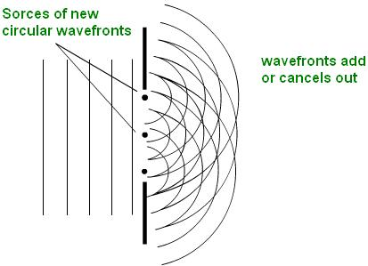
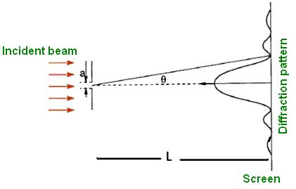

## Theory
When a wave train strikes an obstacle, the light ray will bend at the corners and edges of it, which causes the spreading of light waves into the geometrical shadow of the obstacle. This phenomenon is termed as diffraction.

### Single slit diffraction:

 When waves pass through a gap, which is about as wide as the wavelength they spread out into the region beyond the gap. Huygens considered each point along a wave front to be the source of a secondary disturbance that forms a semi-circular wavelet. Diffraction is due to the superposition of such secondary wavelets. The secondary wavelets spread out and overlap each other interfering with each other to form a pattern of maximum and minimum intensity. The pattern formed on a screen consists of a broad central band of light with dark bands on either side. The dark bands are caused when the light from the top half of the slit destructively interferes with the light from the bottom half.

 

Consider a slit of width ‘a’. Let at an angle θ, the path difference between the top and bottom of the slit is a wavelength. This causes destructive interference to occur because the path difference between the top and the middle of the slit is half of the  wavelength. At this angle all the light from the top half of the slit will get cancelled with the light from the bottom half to produce a dark band.

$$\Delta S=a \sin \theta ........(1)$$

Intensity minima will occur if this path length difference is an integer number of wavelengths.

$$a*\sin (\theta)=n\lambda..........(2)$$

Where,  
$n$ is the order of each minimum. 
$\lambda$ is the wavelength, 
$a$ is the distance between the slits 
$\theta$ is the angle at which destructive interference occurs.  

Intensity  is given by,

$$I=I_0\frac{\sin^2\left( \frac{N\delta}{2} \right)}{\left( \frac{\delta}{2} \right)^2}.............(3)$$

Where $\delta$ is the total phase angle , it can be related to the deviation angle,

$$\delta=\frac{2\pi a*\sin \theta}{\lambda}..........(4)$$

